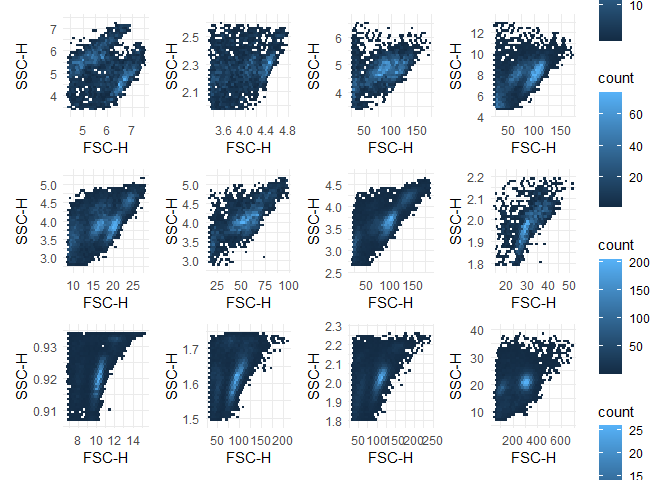
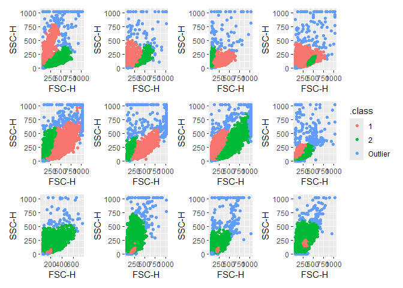
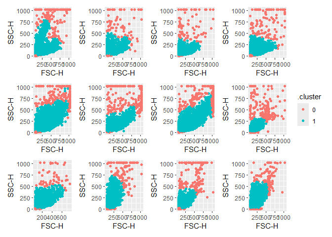

Start by loading the data and make it into a tibble with the relevant list columns:


``` r
gvhd_tibble <- tibble(
  exprs = purrr::map(GvHD, ~ exprs(.x)),                                                            # Expression data
  keywords = purrr::map(GvHD, ~ keyword(.x)),                                                       # Meta data
  exprs_tibble = purrr::map(exprs, function(.x) as_tibble(.x) |> rowid_to_column(var = 'event_id')) # For gating
)

head(gvhd_tibble)
```

```
## # A tibble: 6 × 3
##   exprs              keywords           exprs_tibble         
##   <list>             <list>             <list>               
## 1 <dbl [3,420 × 8]>  <named list [170]> <tibble [3,420 × 9]> 
## 2 <dbl [3,405 × 8]>  <named list [170]> <tibble [3,405 × 9]> 
## 3 <dbl [3,435 × 8]>  <named list [170]> <tibble [3,435 × 9]> 
## 4 <dbl [8,550 × 8]>  <named list [170]> <tibble [8,550 × 9]> 
## 5 <dbl [10,410 × 8]> <named list [170]> <tibble [10,410 × 9]>
## 6 <dbl [3,750 × 8]>  <named list [170]> <tibble [3,750 × 9]>
```
The 'cell gate' will be set using `FSC-H` and `SSC-H` columns. Since the expression
is wildly different between samples, our solution must allow for this: 


```
## `stat_bin()` using `bins = 30`. Pick better value with `binwidth`.
## `stat_bin()` using `bins = 30`. Pick better value with `binwidth`.
## `stat_bin()` using `bins = 30`. Pick better value with `binwidth`.
## `stat_bin()` using `bins = 30`. Pick better value with `binwidth`.
## `stat_bin()` using `bins = 30`. Pick better value with `binwidth`.
## `stat_bin()` using `bins = 30`. Pick better value with `binwidth`.
## `stat_bin()` using `bins = 30`. Pick better value with `binwidth`.
## `stat_bin()` using `bins = 30`. Pick better value with `binwidth`.
```

<!-- -->

We will start by filtering the data to remove the outliers using `dbscan`. It 
requires the two arguments `minPts` and `eps`. The `minPts` is the minimum number 
of points required to form a cluster. The `eps` parameter is the maximum distance
between two points to be considered in the same cluster. 

The `kNNdistplot` function can be used to visually inspect `eps` given `minPts`:


``` r
gvhd_tibble$exprs_tibble[[2]] |> 
  select(2:3) |> # This is the FSC-H and SSC-H columns
  dbscan::kNNdistplot(minPts = 50)

abline(h = 100) # Corresponds to the eps value - sets cut off against outliers
```

<!-- -->

Filtering out the outliers using the parameters determined by the `kNNdistplot`:

``` r
# Map the dbscan over the exprs_tibble column
dbscan_res <- purrr::map(gvhd_tibble$exprs_tibble, function(.x) {
  .x |> 
  dplyr::select(2:3) |> # This is the FSC-H and SSC-H columns 
  dbscan::dbscan(minPts = 50, eps = 100)
})

# Then combine the cluster information in dbscan_res with the event_id, FSC-H and 
# SSC-H values in the exprs_tibble column
dbscan_filt <- purrr::map2(dbscan_res, gvhd_tibble$exprs_tibble, function(.x, .y) {
  dbscan::augment(
    .x, 
    .y |>  dplyr::select(1:3) #event_id, FSC-H, SSC-H
    ) 
    
  }
)

dbscan_filt[[1]]
```

```
## # A tibble: 3,420 × 5
##    event_id `FSC-H` `SSC-H` .cluster noise
##       <int>   <dbl>   <dbl> <fct>    <lgl>
##  1        1     371     396 1        FALSE
##  2        2     190      62 1        FALSE
##  3        3     141     197 1        FALSE
##  4        4     167     265 1        FALSE
##  5        5     128      30 1        FALSE
##  6        6     208      60 1        FALSE
##  7        7     172     280 1        FALSE
##  8        8     236     309 1        FALSE
##  9        9     353      87 1        FALSE
## 10       10      85     127 1        FALSE
## # ℹ 3,410 more rows
```

We can see that `dbscan` did a pretty good job but we still have outliers 
(`noise = TRUE`)in the data - especially events on the border. 
These will have to be filtered out in our recipe.


``` r
# Recipe for pre-processing the data
mclust_rec <- recipes::recipe(~ `FSC-H` + `SSC-H` + `noise` + `event_id`, data = dbscan_filt[[1]]) |>
  step_filter(noise == FALSE) |> 
  update_role(noise, event_id, new_role = 'id variable') |> 
  step_filter(`SSC-H` < 975 & `SSC-H` > 25 & `FSC-H` < 975 & `FSC-H` > 25) |> 
  recipes::step_BoxCox(`FSC-H`, `SSC-H`)

# Prep the recipe on the dbscan filtered data
mclust_prep <- purrr::map(dbscan_filt, function(.x) recipes::prep(mclust_rec, training = .x))

# And then call it 
mclust_bake <- purrr::map(mclust_prep, function(.x) recipes::bake(.x, new_data = NULL))

# And visually inspect the result
plot_list <- mclust_bake |> 
  purrr::map(~ ggplot(data = .x, aes(x = `FSC-H`, y = `SSC-H`)) +
    geom_hex() +
    theme_minimal() +
    scale_y_continuous(
      expand = expansion(mult = c(0.1, 0.1)),
      )
  )

wrap_plots(plot_list[1:12], nrow = 3, guides = 'collect')
```

<!-- -->

Now we can cluster the data using the `Mclust` function from the `mclust` package. 

``` r
mclust_res <- purrr::map(mclust_bake, \(.x) mclust::Mclust(.x[, c(1:2)], G = 1:2))
```

And augment the data with the cluster information:

``` r
mclust_aug <- purrr::map2(mclust_res, mclust_bake, augment)

# Add this information to the original data
mclust_result <- purrr::map2(gvhd_tibble$exprs_tibble, mclust_aug, \(.x, .y) {
  dplyr::left_join(.x, .y, by = 'event_id', suffix = c('', '.clustered')) |> 
    # Change NA values to hold information for relevant columns
    mutate(
      noise = replace_na(noise, TRUE),
      .class = fct_na_value_to_level(.class, 'Outlier')
      )
}) 
```


``` r
dbscan_res <- purrr::map(mclust_bake, function(.x) dbscan::dbscan(.x |> select(1:2), minPts = 50, eps = 40))

dbscan_aug <- purrr::map2(dbscan_res, mclust_bake, augment)

dbscan_result <- purrr::map2(gvhd_tibble$exprs_tibble, dbscan_aug, \(.x, .y) {
  dplyr::left_join(.x, .y, by = 'event_id', suffix = c('', '.clustered')) |> 
    # Change NA values to hold information for relevant columns
    mutate(
      noise = replace_na(noise, TRUE),
      .cluster = fct_na_value_to_level(.cluster, '0')
      )
}) 
```

And visually inspect the result:

Mclust

``` r
plot_list <- mclust_result |> 
  purrr::map(~ ggplot(data = .x, aes(x = `FSC-H`, y = `SSC-H`, color = .class)) +
    geom_point()
  )

wrap_plots(plot_list[1:12], nrow = 3, guides = 'collect') 
```

<!-- -->

dbscan

``` r
plot_list <- dbscan_result |> 
  purrr::map(~ ggplot(data = .x, aes(x = `FSC-H`, y = `SSC-H`, color = .cluster)) +
    geom_point()
  )

wrap_plots(plot_list[1:12], nrow = 3, guides = 'collect') 
```

<!-- -->


Finally, we can save the data to a file:

``` r
final_output <- gvhd_tibble |> 
  mutate(
    cell_gate_mclust = mclust_result,
    cell_gate_dbscan = dbscan_result
    )

# readr::write_rds(final_output, '../data/cell_gating.rds', compress = 'gz')
```
