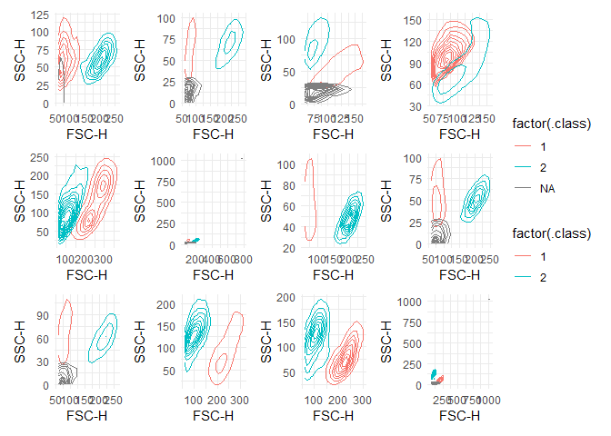

Start by loading the data and make it into a tibble with the relevant list columns:


``` r
gvhd_tibble <- tibble(
  exprs = purrr::map(GvHD, ~ exprs(.x)),                       # This contains detector information
  keywords = purrr::map(GvHD, ~ keyword(.x)),                  # This contains meta data
  exprs_tibble = purrr::map(exprs, function(.x) as_tibble(.x)) # This is for plotting
)

head(gvhd_tibble)
```

```
## # A tibble: 6 × 3
##   exprs              keywords           exprs_tibble         
##   <list>             <list>             <list>               
## 1 <dbl [3,420 × 8]>  <named list [170]> <tibble [3,420 × 8]> 
## 2 <dbl [3,405 × 8]>  <named list [170]> <tibble [3,405 × 8]> 
## 3 <dbl [3,435 × 8]>  <named list [170]> <tibble [3,435 × 8]> 
## 4 <dbl [8,550 × 8]>  <named list [170]> <tibble [8,550 × 8]> 
## 5 <dbl [10,410 × 8]> <named list [170]> <tibble [10,410 × 8]>
## 6 <dbl [3,750 × 8]>  <named list [170]> <tibble [3,750 × 8]>
```

We will gate the 'cell gate' using `FSC-H` and `SSC-H` columns. First inspect the data:


```
## `stat_bin()` using `bins = 30`. Pick better value with `binwidth`.
## `stat_bin()` using `bins = 30`. Pick better value with `binwidth`.
## `stat_bin()` using `bins = 30`. Pick better value with `binwidth`.
## `stat_bin()` using `bins = 30`. Pick better value with `binwidth`.
## `stat_bin()` using `bins = 30`. Pick better value with `binwidth`.
## `stat_bin()` using `bins = 30`. Pick better value with `binwidth`.
## `stat_bin()` using `bins = 30`. Pick better value with `binwidth`.
## `stat_bin()` using `bins = 30`. Pick better value with `binwidth`.
```

<!-- -->

We will start by filtering the data to remove the outliers using dbscan. It 
requires two arguments `minPts` and `eps`. The `minPts` is the minimum number of 
points required to form a cluster. The `eps` is the maximum distance between two 
points to be considered in the same cluster. 

The `kNNdistplot` function can be used to determine the `eps` value:


``` r
gvhd_tibble$exprs_tibble[[2]] |> 
  select(1:2) |> 
  dbscan::kNNdistplot(minPts = 50)

abline(h = 100)
```

<!-- -->


``` r
dbscan_res <- purrr::map(gvhd_tibble$exprs_tibble, function(.x) {
  .x |> 
  dplyr::select(1:2) |> 
  dbscan::dbscan(minPts = 50, eps = 100)
  }
)

dbscan_filt <- purrr::map2(dbscan_res, gvhd_tibble$exprs_tibble, function(.x, .y) {
  dbscan::augment(.x, .y |>  dplyr::select(1:2)) |> 
  dplyr::filter(.cluster != 0) |> 
  dplyr::select(1:2)
  }
)
```


``` r
mclust_rec <- recipe(~ `FSC-H` + `SSC-H`, data = dbscan_filt[[1]]) |> 
  step_filter(`SSC-H` < 1000 & `FSC-H` < 1000) |> 
  step_BoxCox(all_predictors())

mclust_prep <- purrr::map(dbscan_filt, \(.x) recipes::prep(mclust_rec, .x)) 
```

```
## Warning: Non-positive values in selected variable.
```

```
## Warning: No Box-Cox transformation could be estimated for: `SSC-H`.
```

```
## Warning: Non-positive values in selected variable.
```

```
## Warning: No Box-Cox transformation could be estimated for: `SSC-H`.
```

```
## Warning: Non-positive values in selected variable.
```

```
## Warning: No Box-Cox transformation could be estimated for: `SSC-H`.
```

```
## Warning: Non-positive values in selected variable.
```

```
## Warning: No Box-Cox transformation could be estimated for: `SSC-H`.
```

```
## Warning: Non-positive values in selected variable.
```

```
## Warning: No Box-Cox transformation could be estimated for: `SSC-H`.
```

```
## Warning: Non-positive values in selected variable.
```

```
## Warning: No Box-Cox transformation could be estimated for: `SSC-H`.
```

```
## Warning: Non-positive values in selected variable.
```

```
## Warning: No Box-Cox transformation could be estimated for: `SSC-H`.
```

```
## Warning: Non-positive values in selected variable.
```

```
## Warning: No Box-Cox transformation could be estimated for: `SSC-H`.
```

```
## Warning: Non-positive values in selected variable.
```

```
## Warning: No Box-Cox transformation could be estimated for: `SSC-H`.
```

```
## Warning: Non-positive values in selected variable.
```

```
## Warning: No Box-Cox transformation could be estimated for: `SSC-H`.
```

```
## Warning: Non-positive values in selected variable.
```

```
## Warning: No Box-Cox transformation could be estimated for: `SSC-H`.
```

```
## Warning: Non-positive values in selected variable.
```

```
## Warning: No Box-Cox transformation could be estimated for: `SSC-H`.
```

```
## Warning: Non-positive values in selected variable.
```

```
## Warning: No Box-Cox transformation could be estimated for: `SSC-H`.
```

```
## Warning: Non-positive values in selected variable.
```

```
## Warning: No Box-Cox transformation could be estimated for: `SSC-H`.
```

```
## Warning: Non-positive values in selected variable.
```

```
## Warning: No Box-Cox transformation could be estimated for: `SSC-H`.
```

```
## Warning: Non-positive values in selected variable.
```

```
## Warning: No Box-Cox transformation could be estimated for: `SSC-H`.
```

``` r
mclust_bake <- purrr::map2(mclust_prep, dbscan_filt, \(.x, .y) recipes::bake(.x, .y))
```


``` r
mclust_res <- purrr::map(mclust_bake, \(.x) mclust::Mclust(.x, G = 1:2))

mclust_aug <- purrr::map2(mclust_res, mclust_bake, augment)

dbscan_filt_clustered <- purrr::map2(dbscan_filt, mclust_aug, \(.x, .y) {
  dplyr::bind_cols(.x, cluster = .y$.class)
})
```


``` r
plot_list <- dbscan_filt_clustered |> 
  purrr::map(~ ggplot(data = .x, aes(x = `FSC-H`, y = `SSC-H`, color = factor(cluster))) +
    geom_point() +
    theme_minimal()
  )

wrap_plots(plot_list[1:4])
```

<!-- -->

