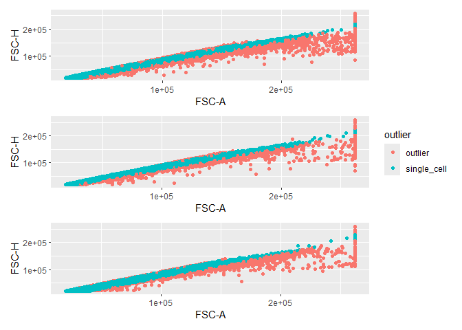

# Introduction

Gating single cells is absolutely necessary to avoid the false positive, cells 
aggregates that naturally have a higher fluorescence signal relative to that of 
a single cell. Thus, proper data analysis requires comparison of only single cells. 
This is a simple example of how to gate out single cells using a linear regression model.

Data to be used comes from the `flowAI` package and is simultaneously loaded and
cleaned using `flow_auto_qc`.


``` r
knitr::opts_chunk$set(echo = TRUE)
library(flowAI)
library(flowCore)
library(tidyverse)
```

```
## ── Attaching core tidyverse packages ──────────────────────── tidyverse 2.0.0 ──
## ✔ dplyr     1.1.4     ✔ readr     2.1.5
## ✔ forcats   1.0.0     ✔ stringr   1.5.1
## ✔ ggplot2   3.5.1     ✔ tibble    3.2.1
## ✔ lubridate 1.9.3     ✔ tidyr     1.3.1
## ✔ purrr     1.0.2     
## ── Conflicts ────────────────────────────────────────── tidyverse_conflicts() ──
## ✖ dplyr::filter() masks flowCore::filter(), stats::filter()
## ✖ dplyr::lag()    masks stats::lag()
## ℹ Use the conflicted package (<http://conflicted.r-lib.org/>) to force all conflicts to become errors
```

``` r
library(patchwork)
library(tidymodels)
```

```
## ── Attaching packages ────────────────────────────────────── tidymodels 1.2.0 ──
## ✔ broom        1.0.6     ✔ rsample      1.2.1
## ✔ dials        1.3.0     ✔ tune         1.2.1
## ✔ infer        1.0.7     ✔ workflows    1.1.4
## ✔ modeldata    1.4.0     ✔ workflowsets 1.1.0
## ✔ parsnip      1.2.1     ✔ yardstick    1.3.1
## ✔ recipes      1.1.0
```

```
## Warning: package 'modeldata' was built under R version 4.4.2
```

```
## ── Conflicts ───────────────────────────────────────── tidymodels_conflicts() ──
## ✖ scales::discard()  masks purrr::discard()
## ✖ dplyr::filter()    masks flowCore::filter(), stats::filter()
## ✖ recipes::fixed()   masks stringr::fixed()
## ✖ dplyr::lag()       masks stats::lag()
## ✖ tune::parameters() masks dials::parameters(), flowCore::parameters()
## ✖ yardstick::spec()  masks readr::spec()
## ✖ recipes::step()    masks stats::step()
## • Use tidymodels_prefer() to resolve common conflicts.
```

``` r
data("Bcells")
```

``` r
b_cleaned <- flowAI::flow_auto_qc(Bcells, html_report = FALSE) # has to be set to FALSE else render fails
```

```
## Quality control for the file: Bcells1
## 23.34% of anomalous cells detected in the flow rate check. 
## 12.49% of anomalous cells detected in signal acquisition check. 
## 7.97% of anomalous cells detected in the dynamic range check. 
## Quality control for the file: Bcells2
## 65.57% of anomalous cells detected in the flow rate check. 
## 0% of anomalous cells detected in signal acquisition check. 
## 3.55% of anomalous cells detected in the dynamic range check. 
## Quality control for the file: Bcells3
## 12.66% of anomalous cells detected in the flow rate check. 
## 0% of anomalous cells detected in signal acquisition check. 
## 1.64% of anomalous cells detected in the dynamic range check.
```

The data is then transformed into a tibble for easier manipulation.


``` r
b_tibble <- tibble(
  exprs = purrr::map(b_cleaned, ~ exprs(.x)),                                                            # Expression data
  keywords = purrr::map(b_cleaned, ~ keyword(.x)),                                                       # Meta data
  exprs_tibble = purrr::map(exprs, function(.x) as_tibble(.x) |> rowid_to_column(var = 'event_id'))      # For gating
)

head(b_tibble)
```

```
## # A tibble: 3 × 3
##   exprs               keywords           exprs_tibble          
##   <list>              <list>             <list>                
## 1 <dbl [48,604 × 13]> <named list [209]> <tibble [48,604 × 14]>
## 2 <dbl [10,292 × 13]> <named list [209]> <tibble [10,292 × 14]>
## 3 <dbl [25,769 × 13]> <named list [209]> <tibble [25,769 × 14]>
```

For gating singlets we will use the parameters `FSC-A` and `FSC-H`. A visual inspection
of the data shows a linear correlation between the two parameters, as expected.
Note that it is common to first gate on cells (e.g. using `FSC-A` and `SSC-A`), 
but this example on focuses on the `FSC-A` and `FSC-H` gating of singlets.


```
## `stat_bin()` using `bins = 30`. Pick better value with `binwidth`.
## `stat_bin()` using `bins = 30`. Pick better value with `binwidth`.
## `stat_bin()` using `bins = 30`. Pick better value with `binwidth`.
## `stat_bin()` using `bins = 30`. Pick better value with `binwidth`.
## `stat_bin()` using `bins = 30`. Pick better value with `binwidth`.
## `stat_bin()` using `bins = 30`. Pick better value with `binwidth`.
```

<!-- -->


``` r
linear_spec <- linear_reg() %>%
  set_engine("lm") |> 
  set_mode("regression")

sc_rec <- recipes::recipe(data = b_tibble$exprs_tibble[[1]], `FSC-A` ~ `FSC-H`) |> 
  step_filter(between(`FSC-A`, 1e03, 2e05), between(`FSC-H`, 1e03, 2e05)) |> 
  step_BoxCox()

sc_wflow <- workflow() |> 
  add_recipe(sc_rec) |> 
  add_model(linear_spec) 

sc_fit <- purrr::map(b_tibble$exprs_tibble, function(.x) fit(sc_wflow, .x))

sc_ci <- purrr::map2(sc_fit, b_tibble$exprs_tibble, function(.x, .y) {
  predict(.x, type = 'pred_int', new_data = .y, level = 0.8)
})

sc_aug <- purrr::map2(sc_fit, b_tibble$exprs_tibble, function(.x, .y) augment(.x, .y)) |> 
  purrr::map2(sc_ci,  ~ bind_cols(.x, .y))
```


``` r
sc_aug[[1]] |> select(contains('.pred'), 'FSC-A','FSC-H')
```

```
## # A tibble: 48,604 × 5
##      .pred .pred_lower .pred_upper `FSC-A` `FSC-H`
##      <dbl>       <dbl>       <dbl>   <dbl>   <dbl>
##  1 103904.      93263.     114545.  94081.   85938
##  2  25829.      15187.      36470.  27751.   22111
##  3  40242.      29601.      50883.  54993.   33894
##  4 134483.     123842.     145124. 123255.  110936
##  5 126109.     115468.     136750. 119127.  104090
##  6 145690.     135049.     156331. 151935.  120098
##  7 172768.     162127.     183409. 176497.  142234
##  8 174384.     163743.     185025. 184517.  143555
##  9 135822.     125181.     146464. 126629.  112031
## 10 107285.      96644.     117926. 120084.   88702
## # ℹ 48,594 more rows
```

``` r
sc_aug[[1]] |> dplyr::filter(`FSC-A` >= .pred_lower & `FSC-A` <= .pred_upper)
```

```
## # A tibble: 40,178 × 18
##      .pred .resid event_id `FSC-A` `FSC-H` `SSC-A` `SSC-H` `APC-Cy7-A`
##      <dbl>  <dbl>    <int>   <dbl>   <dbl>   <dbl>   <dbl>       <dbl>
##  1 103904. -9823.        1  94081.   85938  89924.   82838        601.
##  2  25829.  1923.        2  27751.   22111  27091.   18591       4420 
##  3 126109. -6982.        5 119127.  104090  38621.   35738        664.
##  4 145690.  6244.        6 151935.  120098 135744.  116550       5845.
##  5 172768.  3729.        7 176497.  142234 141455.  118622       4368.
##  6 174384. 10133.        8 184517.  143555 152677.  128387       5012.
##  7 135822. -9194.        9 126629.  112031  47912.   44299        994.
##  8 125512. -7339.       13 118173.  103602  47515.   44594       1136.
##  9 132621. -7478.       14 125143.  109414  46935.   43158        141.
## 10 135270. -7347.       16 127922.  111579  43722.   40251        344.
## # ℹ 40,168 more rows
## # ℹ 10 more variables: `Pacific Blue-A` <dbl>, `AmCyan-A` <dbl>,
## #   `Qdot 605-A` <dbl>, `Qdot 655-A` <dbl>, `PE-A` <dbl>,
## #   `PE-Texas Red-A` <dbl>, `PE-Cy7-A` <dbl>, Time <dbl>, .pred_lower <dbl>,
## #   .pred_upper <dbl>
```


``` r
plot_list <- purrr::map(sc_aug, function(.x) {
  .x |>
    mutate(outlier = case_when(
    `FSC-A` < .pred_lower ~ 'low',
    `FSC-A` > .pred_upper ~ 'high',
    TRUE ~ 'normal'
  )) |>
  ggplot(aes(x = `FSC-A`, y = `FSC-H`)) +
  geom_point(aes(color = outlier))
})

wrap_plots(plot_list, nrow = 3, guides = 'collect')
```

<!-- -->
