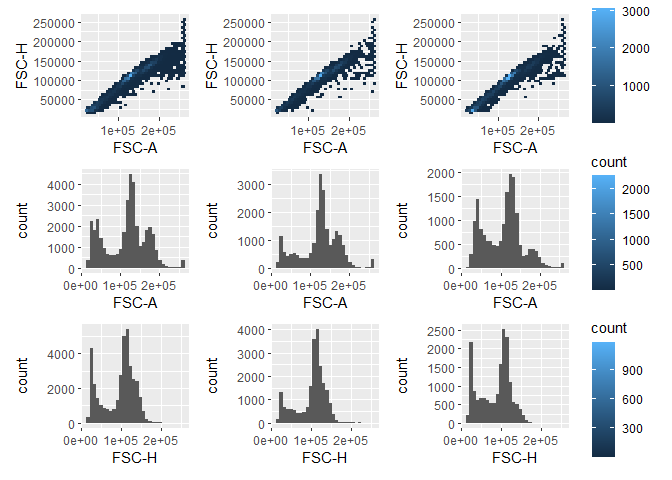

# Introduction

Gating single cells is absolutely necessary to avoid the false positive, cells 
aggregates that naturally have a higher fluorescence signal relative to that of 
a single cell. Thus, proper data analysis requires comparison of only single cells. 
This is a simple example of how to gate out single cells using a linear regression model.

Data to be used comes from the `flowAI` package and is simultaneously loaded and
cleaned using `flow_auto_qc`.


``` r
knitr::opts_chunk$set(echo = TRUE)
library(flowAI)
library(flowCore)
library(tidyverse)
```

```
## ── Attaching core tidyverse packages ──────────────────────── tidyverse 2.0.0 ──
## ✔ dplyr     1.1.4     ✔ readr     2.1.5
## ✔ forcats   1.0.0     ✔ stringr   1.5.1
## ✔ ggplot2   3.5.1     ✔ tibble    3.2.1
## ✔ lubridate 1.9.4     ✔ tidyr     1.3.1
## ✔ purrr     1.0.2     
## ── Conflicts ────────────────────────────────────────── tidyverse_conflicts() ──
## ✖ dplyr::filter() masks flowCore::filter(), stats::filter()
## ✖ dplyr::lag()    masks stats::lag()
## ℹ Use the conflicted package (<http://conflicted.r-lib.org/>) to force all conflicts to become errors
```

``` r
library(patchwork)
library(tidymodels)
```

```
## ── Attaching packages ────────────────────────────────────── tidymodels 1.2.0 ──
## ✔ broom        1.0.7     ✔ rsample      1.2.1
## ✔ dials        1.3.0     ✔ tune         1.2.1
## ✔ infer        1.0.7     ✔ workflows    1.1.4
## ✔ modeldata    1.4.0     ✔ workflowsets 1.1.0
## ✔ parsnip      1.2.1     ✔ yardstick    1.3.1
## ✔ recipes      1.1.0     
## ── Conflicts ───────────────────────────────────────── tidymodels_conflicts() ──
## ✖ scales::discard()  masks purrr::discard()
## ✖ dplyr::filter()    masks flowCore::filter(), stats::filter()
## ✖ recipes::fixed()   masks stringr::fixed()
## ✖ dplyr::lag()       masks stats::lag()
## ✖ tune::parameters() masks dials::parameters(), flowCore::parameters()
## ✖ yardstick::spec()  masks readr::spec()
## ✖ recipes::step()    masks stats::step()
## • Learn how to get started at https://www.tidymodels.org/start/
```

``` r
data("Bcells")
```

``` r
b_cleaned <- flowAI::flow_auto_qc(Bcells, html_report = FALSE) # has to be set to FALSE else render fails
```

```
## Quality control for the file: Bcells1
## 32.84% of anomalous cells detected in the flow rate check. 
## 12.49% of anomalous cells detected in signal acquisition check. 
## 7.97% of anomalous cells detected in the dynamic range check. 
## Quality control for the file: Bcells2
## 24.85% of anomalous cells detected in the flow rate check. 
## 0% of anomalous cells detected in signal acquisition check. 
## 3.55% of anomalous cells detected in the dynamic range check. 
## Quality control for the file: Bcells3
## 42.4% of anomalous cells detected in the flow rate check. 
## 0% of anomalous cells detected in signal acquisition check. 
## 1.64% of anomalous cells detected in the dynamic range check.
```

The data is then transformed into a tibble for easier manipulation.


``` r
b_tibble <- tibble(
  exprs = purrr::map(b_cleaned, ~ exprs(.x)),                                                            # Expression data
  keywords = purrr::map(b_cleaned, ~ keyword(.x)),                                                       # Meta data
  exprs_tibble = purrr::map(exprs, function(.x) as_tibble(.x) |> rowid_to_column(var = 'event_id'))      # For gating
)

head(b_tibble)
```

```
## # A tibble: 3 × 3
##   exprs               keywords           exprs_tibble          
##   <list>              <list>             <list>                
## 1 <dbl [37,680 × 13]> <named list [209]> <tibble [37,680 × 14]>
## 2 <dbl [22,149 × 13]> <named list [209]> <tibble [22,149 × 14]>
## 3 <dbl [16,993 × 13]> <named list [209]> <tibble [16,993 × 14]>
```

For gating singlets we will use the parameters `FSC-A` and `FSC-H`. A visual inspection
of the data shows a linear correlation between the two parameters, as expected.
Note that it is common to first gate on cells (e.g. using `FSC-A` and `SSC-A`), 
but this example on focuses on the `FSC-A` and `FSC-H` gating of singlets.


```
## `stat_bin()` using `bins = 30`. Pick better value with `binwidth`.
## `stat_bin()` using `bins = 30`. Pick better value with `binwidth`.
## `stat_bin()` using `bins = 30`. Pick better value with `binwidth`.
## `stat_bin()` using `bins = 30`. Pick better value with `binwidth`.
## `stat_bin()` using `bins = 30`. Pick better value with `binwidth`.
## `stat_bin()` using `bins = 30`. Pick better value with `binwidth`.
```

<!-- -->

The linear regression model is then trained on the data and used to predict the 
`FSC-A` given `FSC-H`. The model is then used to predict the 80% prediction interval
and keep only these cells. The cells outside the interval are considered to be outliers.


``` r
linear_spec <- linear_reg() %>% # Create a linear regression model
  set_engine("lm") |>           # Use the lm engine 
  set_mode("regression")        # Set mode to regression

sc_rec <- recipes::recipe(data = b_tibble$exprs_tibble[[1]], `FSC-A` ~ `FSC-H`) |> # Create a recipe where FSC-A is predicted by FSC-H
  step_filter(between(`FSC-A`, 1e03, 2e05), between(`FSC-H`, 1e03, 2e05)) |>       # Filter out extreme values
  step_BoxCox()                                                                    # Transform the data

sc_wflow <- workflow() |> # Create a workflow
  add_recipe(sc_rec) |>   # Add the recipe
  add_model(linear_spec)  # Add the model

sc_fit <- purrr::map(b_tibble$exprs_tibble, function(.x) fit(sc_wflow, .x)) # Fit the model to the data

sc_ci <- purrr::map2(sc_fit, b_tibble$exprs_tibble, function(.x, .y) {
  predict(.x, type = 'pred_int', new_data = .y, level = 0.8) # Predict the 80% prediction interval
})

sc_aug <- purrr::map2(sc_fit, b_tibble$exprs_tibble, function(.x, .y) augment(.x, .y)) |> # Augment the data with the predicted values
  purrr::map2(sc_ci,  ~ bind_cols(.x, .y))                                                # Augment the data with the prediction interval
```

The data is then filtered to only include cells within the 80% prediction interval.

``` r
sc_aug[[1]] |> select(contains('.pred'), 'FSC-A','FSC-H')                     # Before
```

```
## # A tibble: 37,680 × 5
##      .pred .pred_lower .pred_upper `FSC-A` `FSC-H`
##      <dbl>       <dbl>       <dbl>   <dbl>   <dbl>
##  1  35828.      25221.      46435.  30611.   30290
##  2 128927.     118321.     139534. 124112.  106378
##  3 139724.     129117.     150331. 134708.  115202
##  4 119952.     109346.     130559. 119503.   99043
##  5 143493.     132886.     154099. 136813.  118282
##  6  46019.      35412.      56626.  39552.   38619
##  7 158847.     148240.     169454. 164848.  130831
##  8 168915.     158308.     179522. 170479.  139059
##  9 131187.     120580.     141794. 122279.  108225
## 10 116852.     106245.     127459. 112717.   96509
## # ℹ 37,670 more rows
```

``` r
sc_aug[[1]] |> dplyr::filter(`FSC-A` >= .pred_lower & `FSC-A` <= .pred_upper) # After
```

```
## # A tibble: 31,075 × 18
##      .pred .resid event_id `FSC-A` `FSC-H` `SSC-A` `SSC-H` `APC-Cy7-A`
##      <dbl>  <dbl>    <int>   <dbl>   <dbl>   <dbl>   <dbl>       <dbl>
##  1  35828. -5217.        1  30611.   30290  22763.   21638       888. 
##  2 128927. -4815.        2 124112.  106378  51945.   47978       633. 
##  3 139724. -5016.        3 134708.  115202  57564.   53426      1052. 
##  4 119952.  -450.        4 119503.   99043  55520.   46871      1241  
##  5 143493. -6679.        5 136813.  118282  66030.   57550       952  
##  6  46019. -6467.        6  39552.   38619  10252    10383       -97.8
##  7 158847.  6001.        7 164848.  130831 113377.   96127      6571. 
##  8 168915.  1564.        8 170479.  139059 112870.   99507      5448. 
##  9 131187. -8908.        9 122279.  108225  63987.   59089      1942. 
## 10 116852. -4135.       10 112717.   96509  43555.   38809      1538. 
## # ℹ 31,065 more rows
## # ℹ 10 more variables: `Pacific Blue-A` <dbl>, `AmCyan-A` <dbl>,
## #   `Qdot 605-A` <dbl>, `Qdot 655-A` <dbl>, `PE-A` <dbl>,
## #   `PE-Texas Red-A` <dbl>, `PE-Cy7-A` <dbl>, Time <dbl>, .pred_lower <dbl>,
## #   .pred_upper <dbl>
```

Plot the data with the outliers colored.

``` r
plot_list <- purrr::map(sc_aug, function(.x) {
  .x |>
    mutate(outlier = case_when(
    `FSC-A` < .pred_lower ~ 'outlier',
    `FSC-A` > .pred_upper ~ 'outlier',
    TRUE ~ 'single_cell'
  )) |>
  ggplot(aes(x = `FSC-A`, y = `FSC-H`)) +
  geom_point(aes(color = outlier))
})

wrap_plots(plot_list, nrow = 3, guides = 'collect')
```

<!-- -->
