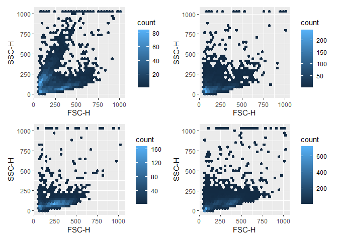
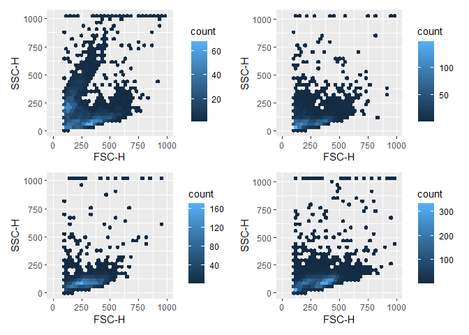
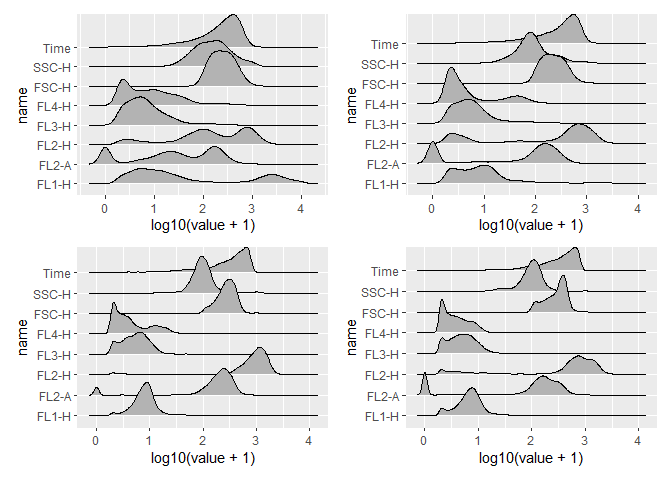
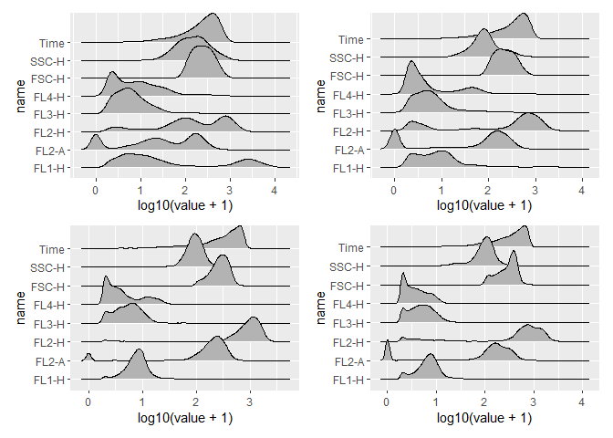
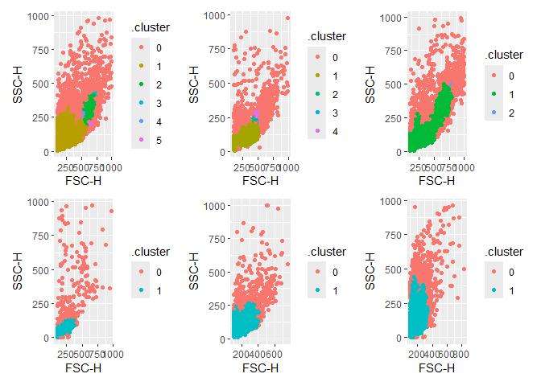

## Welcome!

This is a document that aims to explore different ways of gating flow cytometry
data in R, primarily using a tidymodels approach.

To do this, I am using the data set `GvHD` from `flowCore`. Note that I am not 
compensating or cleaning the data, since this is not meant to represent a complete
flow cytometry analysis pipeline.


Start by loading the data and make it into a tibble with the relevant list columns:


``` r
gvhd_tibble <- tibble(
  exprs = purrr::map(GvHD, ~ exprs(.x)),                       # This contains detector information
  keywords = purrr::map(GvHD, ~ keyword(.x)),                  # This contains meta data
  exprs_tibble = purrr::map(exprs, function(.x) as_tibble(.x)) # This is for plotting
)

head(gvhd_tibble)
```

```
## # A tibble: 6 × 3
##   exprs              keywords           exprs_tibble         
##   <list>             <list>             <list>               
## 1 <dbl [3,420 × 8]>  <named list [170]> <tibble [3,420 × 8]> 
## 2 <dbl [3,405 × 8]>  <named list [170]> <tibble [3,405 × 8]> 
## 3 <dbl [3,435 × 8]>  <named list [170]> <tibble [3,435 × 8]> 
## 4 <dbl [8,550 × 8]>  <named list [170]> <tibble [8,550 × 8]> 
## 5 <dbl [10,410 × 8]> <named list [170]> <tibble [10,410 × 8]>
## 6 <dbl [3,750 × 8]>  <named list [170]> <tibble [3,750 × 8]>
```

We will gate the 'cell gate' using `FSC-H` and `SSC-H` columns. First inspect the data:


``` r
plot_list <- gvhd_tibble$exprs_tibble |> purrr::map(function(.x) {
      ggplot(data= .x, aes(x = `FSC-H`, y = `SSC-H`)) +
        geom_hex()
    }
  )

wrap_plots(plot_list[1:4])
```

<!-- -->

We clean up the data by filtering out FSC-H < 100:


``` r
gvhd_tibble <- gvhd_tibble |> 
  mutate(exprs_tibble = purrr::map(gvhd_tibble$exprs_tibble, ~ filter(.x, `FSC-H` > 99 & `FSC-H` < 1000 & `SSC-H` < 1000)))

plot_list <- gvhd_tibble$exprs_tibble |> purrr::map(function(.x) {
      ggplot(data= .x, aes(x = `FSC-H`, y = `SSC-H`)) +
        geom_hex() +
    scale_x_continuous(limits = c(0,1000))
    }
  )

wrap_plots(plot_list[1:4])
```

<!-- -->

Use the cleaned data for making training and testing sets:


``` r
gvhd_tibble <- gvhd_tibble |> mutate(
  initial_split = purrr::map(exprs_tibble, ~ initial_split(.x, strata = `FSC-H`, prop = 0.8)),
  training = purrr::map(initial_split, ~ training(.x)),
  test = purrr::map(initial_split, ~ testing(.x))
)

plot_list <- gvhd_tibble$training |> purrr::map(function(.x) {
      ggplot(data= .x, aes(x = `FSC-H`, y = `SSC-H`)) +
        geom_hex() +
    scale_x_continuous(limits = c(0,1000))
    }
  )

wrap_plots(plot_list[1:4])
```

<!-- -->

Now we have a look at the recorded marker expression:


``` r
plot_list <- gvhd_tibble$exprs_tibble |> purrr::map(function(.x) {
  .x |> 
    pivot_longer(where(is.numeric)) |>
    ggplot(aes(x = log10(value + 1), y = name)) +
      ggridges::geom_density_ridges() 
    }
  )

wrap_plots(plot_list[1:4])
```

```
## Picking joint bandwidth of 0.108
```

```
## Picking joint bandwidth of 0.0965
```

```
## Picking joint bandwidth of 0.0451
```

```
## Picking joint bandwidth of 0.0437
```

<!-- -->

It looks like FL2-A is a clearly separated population, which we can use for 
semi-supervised clustering:


``` r
fl2a_positive <- gvhd_tibble$exprs_tibble |> 
  purrr:::map(function(.x) if_else(log10(.x$`FL2-A` + 1) > 1, 1, 0))
```
## Clustering
We will try three different methods for gating the FSC-H vs SSC-H
1) `dbscan`
2) `Mclust`
3) semi-supervised clustering and random forest

### `dbscan`


``` r
dbscan_recipe <- gvhd_tibble$training |> 
  purrr:::map(function(.x) recipe(~ `FSC-H` + `SSC-H`, data = .x)) |> 
  step_scale(all_predictors()) |>
  step_log(all_predictors())
```


``` r
dbscan_prep <- dbscan_recipe[1:(length(dbscan_recipe)-1)] |> purrr:::map(function(.x) prep(.x))
  
dbscan_bake <- dbscan_prep |> map(function(.x) bake(.x, new_data = NULL))
```


``` r
dbscan_result <- dbscan_bake |> map(function(.x) dbscan::dbscan(.x, eps = 20, minPts = 20))
```


``` r
gvhd_tibble <- gvhd_tibble |> 
  mutate(training = map2(.x = dbscan_result, .y = dbscan_bake, .f = function(.x, .y) augment(.x, .y)))
```


``` r
map(dbscan_result, function(.x) dbscan::tidy(.x))
```

```
## [[1]]
## # A tibble: 4 × 3
##   cluster  size noise
##   <fct>   <int> <lgl>
## 1 0         627 TRUE 
## 2 1        1455 FALSE
## 3 2          36 FALSE
## 4 3          21 FALSE
## 
## [[2]]
## # A tibble: 2 × 3
##   cluster  size noise
##   <fct>   <int> <lgl>
## 1 0         377 TRUE 
## 2 1        1477 FALSE
## 
## [[3]]
## # A tibble: 2 × 3
##   cluster  size noise
##   <fct>   <int> <lgl>
## 1 0         181 TRUE 
## 2 1        2107 FALSE
## 
## [[4]]
## # A tibble: 2 × 3
##   cluster  size noise
##   <fct>   <int> <lgl>
## 1 0         332 TRUE 
## 2 1        4890 FALSE
## 
## [[5]]
## # A tibble: 6 × 3
##   cluster  size noise
##   <fct>   <int> <lgl>
## 1 0         931 TRUE 
## 2 1        5301 FALSE
## 3 2         455 FALSE
## 4 3          20 FALSE
## 5 4          20 FALSE
## 6 5          20 FALSE
## 
## [[6]]
## # A tibble: 5 × 3
##   cluster  size noise
##   <fct>   <int> <lgl>
## 1 0         621 TRUE 
## 2 1        1870 FALSE
## 3 2          22 FALSE
## 4 3          25 FALSE
## 5 4          20 FALSE
## 
## [[7]]
## # A tibble: 3 × 3
##   cluster  size noise
##   <fct>   <int> <lgl>
## 1 0         822 TRUE 
## 2 1        8516 FALSE
## 3 2          28 FALSE
## 
## [[8]]
## # A tibble: 2 × 3
##   cluster  size noise
##   <fct>   <int> <lgl>
## 1 0         248 TRUE 
## 2 1        1355 FALSE
## 
## [[9]]
## # A tibble: 2 × 3
##   cluster  size noise
##   <fct>   <int> <lgl>
## 1 0         370 TRUE 
## 2 1        8885 FALSE
## 
## [[10]]
## # A tibble: 2 × 3
##   cluster  size noise
##   <fct>   <int> <lgl>
## 1 0         480 TRUE 
## 2 1        7476 FALSE
## 
## [[11]]
## # A tibble: 2 × 3
##   cluster  size noise
##   <fct>   <int> <lgl>
## 1 0         293 TRUE 
## 2 1        8680 FALSE
## 
## [[12]]
## # A tibble: 2 × 3
##   cluster  size noise
##   <fct>   <int> <lgl>
## 1 0         485 TRUE 
## 2 1        9337 FALSE
## 
## [[13]]
## # A tibble: 2 × 3
##   cluster  size noise
##   <fct>   <int> <lgl>
## 1 0         335 TRUE 
## 2 1        9233 FALSE
## 
## [[14]]
## # A tibble: 2 × 3
##   cluster  size noise
##   <fct>   <int> <lgl>
## 1 0         259 TRUE 
## 2 1        2783 FALSE
## 
## [[15]]
## # A tibble: 3 × 3
##   cluster  size noise
##   <fct>   <int> <lgl>
## 1 0         652 TRUE 
## 2 1       10325 FALSE
## 3 2          95 FALSE
## 
## [[16]]
## # A tibble: 2 × 3
##   cluster  size noise
##   <fct>   <int> <lgl>
## 1 0         330 TRUE 
## 2 1        4647 FALSE
## 
## [[17]]
## # A tibble: 3 × 3
##   cluster  size noise
##   <fct>   <int> <lgl>
## 1 0         356 TRUE 
## 2 1       12336 FALSE
## 3 2          27 FALSE
## 
## [[18]]
## # A tibble: 4 × 3
##   cluster  size noise
##   <fct>   <int> <lgl>
## 1 0         241 TRUE 
## 2 1       26740 FALSE
## 3 2          21 FALSE
## 4 3          30 FALSE
## 
## [[19]]
## # A tibble: 3 × 3
##   cluster  size noise
##   <fct>   <int> <lgl>
## 1 0         601 TRUE 
## 2 1       20615 FALSE
## 3 2          29 FALSE
## 
## [[20]]
## # A tibble: 3 × 3
##   cluster  size noise
##   <fct>   <int> <lgl>
## 1 0         461 TRUE 
## 2 1        8467 FALSE
## 3 2          60 FALSE
## 
## [[21]]
## # A tibble: 2 × 3
##   cluster  size noise
##   <fct>   <int> <lgl>
## 1 0         626 TRUE 
## 2 1        9287 FALSE
## 
## [[22]]
## # A tibble: 2 × 3
##   cluster  size noise
##   <fct>   <int> <lgl>
## 1 0         461 TRUE 
## 2 1        8507 FALSE
## 
## [[23]]
## # A tibble: 3 × 3
##   cluster  size noise
##   <fct>   <int> <lgl>
## 1 0         380 TRUE 
## 2 1        4599 FALSE
## 3 2          24 FALSE
## 
## [[24]]
## # A tibble: 2 × 3
##   cluster  size noise
##   <fct>   <int> <lgl>
## 1 0         153 TRUE 
## 2 1        2130 FALSE
## 
## [[25]]
## # A tibble: 2 × 3
##   cluster  size noise
##   <fct>   <int> <lgl>
## 1 0         248 TRUE 
## 2 1        3437 FALSE
## 
## [[26]]
## # A tibble: 2 × 3
##   cluster  size noise
##   <fct>   <int> <lgl>
## 1 0         442 TRUE 
## 2 1       21989 FALSE
## 
## [[27]]
## # A tibble: 2 × 3
##   cluster  size noise
##   <fct>   <int> <lgl>
## 1 0         457 TRUE 
## 2 1       18055 FALSE
## 
## [[28]]
## # A tibble: 5 × 3
##   cluster  size noise
##   <fct>   <int> <lgl>
## 1 0         851 TRUE 
## 2 1        7759 FALSE
## 3 2         493 FALSE
## 4 3          27 FALSE
## 5 4          27 FALSE
## 
## [[29]]
## # A tibble: 2 × 3
##   cluster  size noise
##   <fct>   <int> <lgl>
## 1 0         606 TRUE 
## 2 1       10643 FALSE
## 
## [[30]]
## # A tibble: 2 × 3
##   cluster  size noise
##   <fct>   <int> <lgl>
## 1 0         274 TRUE 
## 2 1        1887 FALSE
## 
## [[31]]
## # A tibble: 2 × 3
##   cluster  size noise
##   <fct>   <int> <lgl>
## 1 0         261 TRUE 
## 2 1        1577 FALSE
## 
## [[32]]
## # A tibble: 2 × 3
##   cluster  size noise
##   <fct>   <int> <lgl>
## 1 0         313 TRUE 
## 2 1        3056 FALSE
## 
## [[33]]
## # A tibble: 2 × 3
##   cluster  size noise
##   <fct>   <int> <lgl>
## 1 0        1074 TRUE 
## 2 1       12712 FALSE
## 
## [[34]]
## # A tibble: 3 × 3
##   cluster  size noise
##   <fct>   <int> <lgl>
## 1 0         924 TRUE 
## 2 1       14106 FALSE
## 3 2          50 FALSE
## 
## [[35]]
## # A tibble: 3 × 3
##   cluster  size noise
##   <fct>   <int> <lgl>
## 1 0         772 TRUE 
## 2 1       14327 FALSE
## 3 2          21 FALSE
```


``` r
plot_list <- gvhd_tibble$training |> purrr::map(function(.x) {
      ggplot(data= .x, aes(x = `FSC-H`, y = `SSC-H`, color = .cluster)) +
      geom_point() 
    }
  )

wrap_plots(plot_list[5:10])
```

<!-- -->
