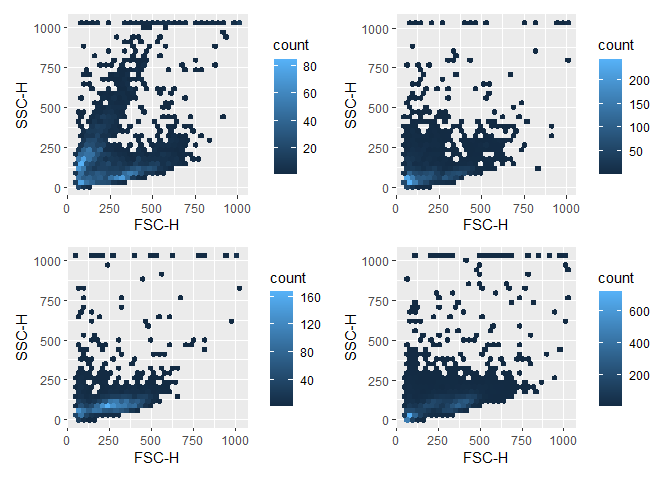

## Mclust

An R package implementing Gaussian Mixture Modelling for Model-Based Clustering, Classification, and Density Estimation, <https://mclust-org.github.io/mclust/index.html>.

Start by loading the data and make it into a tibble with the relevant list columns


``` r
data(GvHD)
gvhd_tibble <- tibble(
  exprs = purrr::map(GvHD, ~ exprs(.x)),                       # This contains detector information
  keywords = purrr::map(GvHD, ~ keyword(.x)),                  # This contains meta data
  exprs_tibble = purrr::map(exprs, function(.x) as_tibble(.x)) # This is for plotting
)

head(gvhd_tibble)
```

```
## # A tibble: 6 × 3
##   exprs              keywords           exprs_tibble         
##   <list>             <list>             <list>               
## 1 <dbl [3,420 × 8]>  <named list [170]> <tibble [3,420 × 8]> 
## 2 <dbl [3,405 × 8]>  <named list [170]> <tibble [3,405 × 8]> 
## 3 <dbl [3,435 × 8]>  <named list [170]> <tibble [3,435 × 8]> 
## 4 <dbl [8,550 × 8]>  <named list [170]> <tibble [8,550 × 8]> 
## 5 <dbl [10,410 × 8]> <named list [170]> <tibble [10,410 × 8]>
## 6 <dbl [3,750 × 8]>  <named list [170]> <tibble [3,750 × 8]>
```

We will start with doing the 'cell gate' using `FSC-H` and `SSC-H` columns. First inspect the data:


``` r
plot_list <- gvhd_tibble$exprs_tibble |> purrr::map(function(.x) {
      ggplot(data= .x, aes(x = `FSC-H`, y = `SSC-H`)) +
        geom_hex()
    }
  )

wrap_plots(plot_list[1:4])
```

<!-- -->
